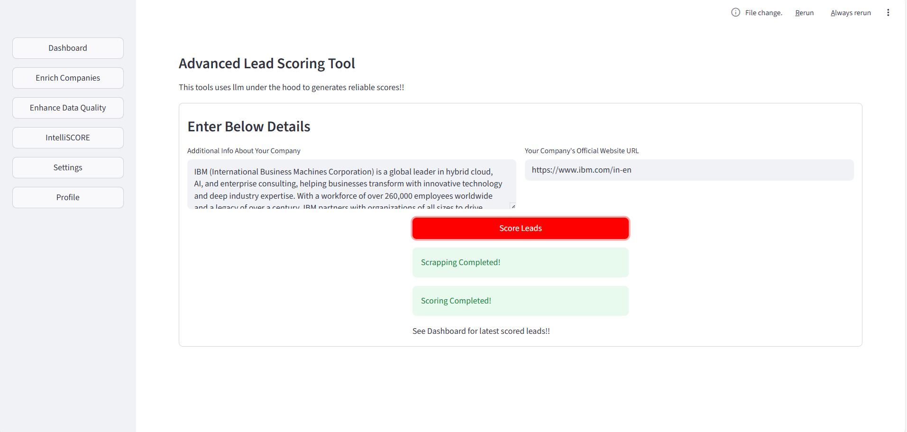

# <p align="center"> Caprae Capital Lead Generation Tool</p>
## <p align="center">About</p>
This tool is intended to generate potential leads based on lead parameters and some of the generator's info. It leverages advanced tools like intelliegent scraping and extraction which on the other hand, implements embedder model (all-MiniLM-L6-v2) and gemini-2.5-flash internally to given precise and reliable lead informations. This tools also implements IntelliSCORE which is a custom-built advanced lead scoring tool which automatically generate accurate scores by comparing generator data and lead's data. If you click <b>Intelligent Enrichment</b> option in the <b>Enrich</b> tool, it will automatically do all of the tool's tasks so that you don't have to manually implement the post-extraction tools.
## <p align="center">Features</p>
<h3>This Tool leverages a 4 stage data pipeline in a single process.</h3>

1. Data Cleaning (Removing Noise and parsing data in proper format).
2. Website URL enrichment(If required)
3. Data enhancement by removing duplicates and handling None/NaN type data
4. Lead scoring using custom-built IntelliSCORE microservice

## <p align="center">Innovation</p>
This tool is configured in such a way that you can do either manual entry or intelligent entry. This feature clearly differentiates itself with the existing lead generation tools. The <b>IntelliSCORE</b> tool also does the intelligent lead scoring and sorting which no other existing tool currently does. The idea of Embedding models in the process in also quite innovative from technical angle. If we talk about the <b>Data Enhancement</b> tool, it also utilizes embedding model internally to enhance data quality tremendously.
Further this tool generate accurate pi-charts and bar charts to help differentiate between the leads and understand the lead states at a glance. So you can think of this tools as a lead generator as well as a <b>post-mortem</b> tool for accurate understanding of lead states. <i>These features, in my opinion, clearly tell the difference.</i> 

## <p align="center">How to use?</p>

1. <h3>First, clone the repository</h3>
```markdown
git clone https://github.com/subhajit11010/Caprae_Capital_Assignment_Lead_Generation_Tool.git
```
2. <h3>Open the folder in terminal and paste the below and Enter</h3>
```markdown
pip install requirements.txt
```
3. <h3>Create a <b>.env</b> file at the root of this folder.</h3>
4. <h3>Gather your Google Gemini API key and paste that key as well as this text in seperate lines in the .env file.</h3>
```markdown
PYPPETEER_CHROMIUM_REVISION = '1263111'
```
5. <h3>Now, all the setups are completed. Just paste this text in the terminal and Enter.</h3>
```markdown
streamlit run app.py
```
<h3>You will now see a browser tab is opened and the app is running smoothly. That's it!! YOUR LEAD GENERATION TASK IS NOW AT YOUR FINGERTIPS!!! 😊😊🤩</h3>

## <h3>Here are some attached pics of the application at it's various stages.</h3>




